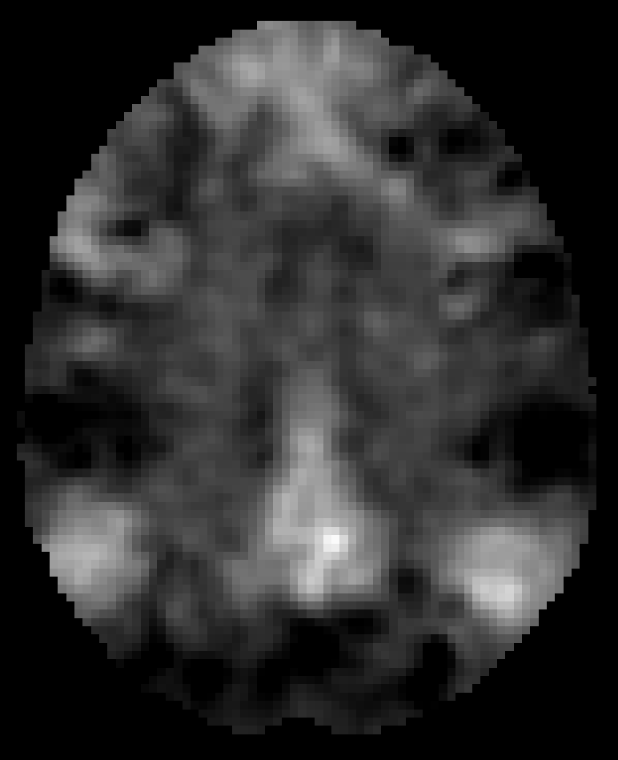
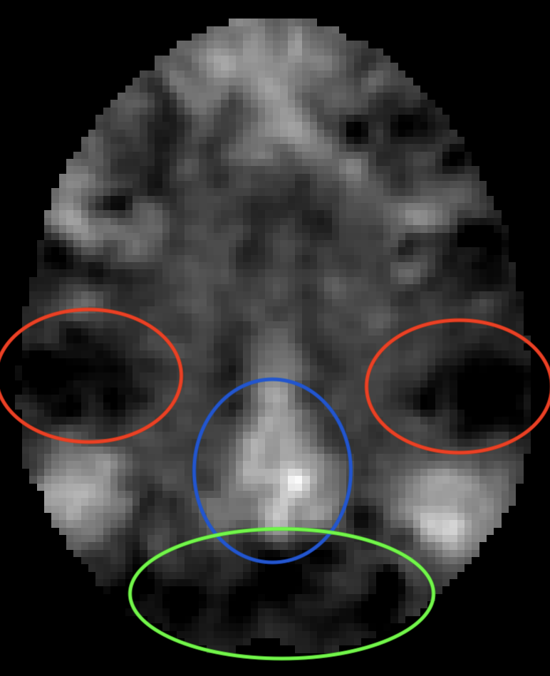

---

You might have noticed that my website's thumbnail is a bit weird. When working on [the Mooney project](<>), I came across this slice in one of the fMRI scans:

It looked like a little gremlin face to me, so I decided to use it as my website's thumbnail. Just to make sure you understand how exactly I interpreted it, here is the image with the face highlighted:

Here, red circles highlight the eyes, the blue circle highlights the nose, and the green circle highlights the mouth. My wife disagrees with my interpretation, but I think it's pretty clear. 